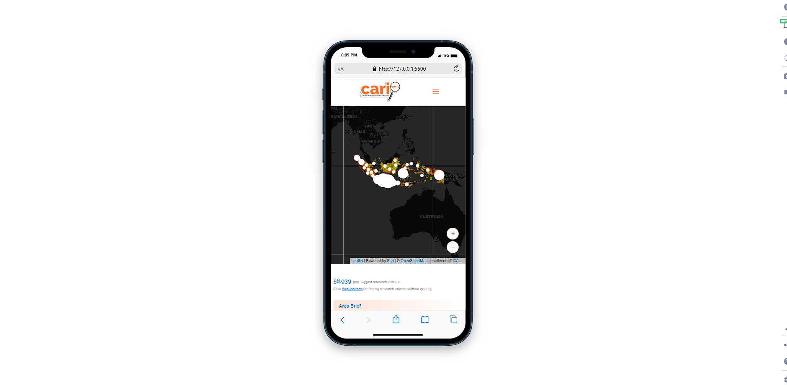
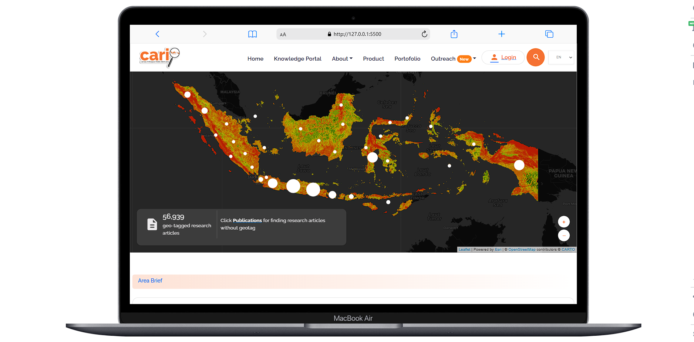

<h1 align="center">CARI! Bencana</h1>

  Built with HTML5, CSS, JS.

## Table of Contents

- [Introduction](#introduction)
- [Features](#features)
- [Requirements](#requirements)
- [Usage](#usage-for-development)
- [Screenshots](#screenshots)
- [Contributors](#contributors)

## Introduction

<b>CARI</b> Cerdas Antisipasi Risiko bencana (CARI!) is a information technology-based start-up working to enhance the knowledge management for disaster risk reduction.

## Features

- Just made navbar more functional for user experience and others small update.

## Requirements

- VSCode

## Usage for development

1. Open your terminal or command prompt
2. Type `git clone https://github.com/rzkiyprtm/cari-knowledge-publication`
3. Open with your text editor
4. Start to edit and develop with live server.

## Screenshots

    
    
    

## Contributors

  <table>
    <tr>
      <td align="center">
        <a href="https://github.com/rzkiyprtm">
           
          <b>Rizky Putra Pratama</b>
        </a>
      </td>
    </tr>
  </table>

